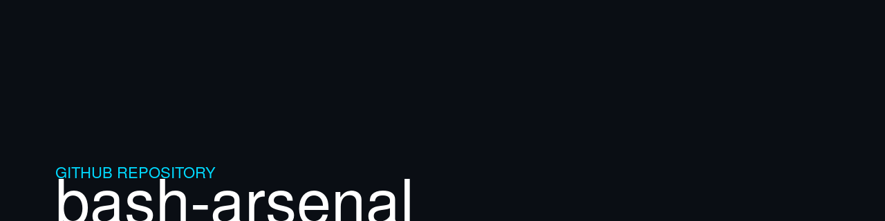

# bash-arsenal

A curated collection of Bash scripts I wrote while learning the shell, organized
by skill level. Every script is heavily commented so it teaches as you read it.

Built and maintained by [zhameersheraz](https://github.com/zhameersheraz).

## Quick start

```bash
git clone https://github.com/zhameersheraz/bash-arsenal.git
cd bash-arsenal
chmod +x 01-basics/*.sh
./01-basics/hello.sh
```

## Layout

| Folder              | What lives there                                       |
| ------------------- | ------------------------------------------------------ |
| `01-basics/`        | echo, variables, if/else, loops, functions             |
| `02-intermediate/`  | arrays, case, string ops, argument parsing, file ops   |
| `03-advanced/`      | error handling, traps, networking, parallel jobs       |
| `04-projects/`      | Real, usable scripts (backup, scanner, sysinfo, logs)  |

## Learning path

1. Read `01-basics/` top to bottom. Run each one. Break it on purpose and read
   the error.
2. Move to `02-intermediate/`. These are the patterns you'll use 80% of the time.
3. `03-advanced/` is for when you want to write scripts you'd actually deploy.
4. `04-projects/` ties it all together. Read these last as capstone examples.

## Cheatsheet

See [cheatsheet.md](cheatsheet.md) for a one-page Bash reference.

## Contributing

See [CONTRIBUTING.md](CONTRIBUTING.md). PRs welcome for new scripts, fixes, or
better comments.

## License

MIT — see [LICENSE](LICENSE).
